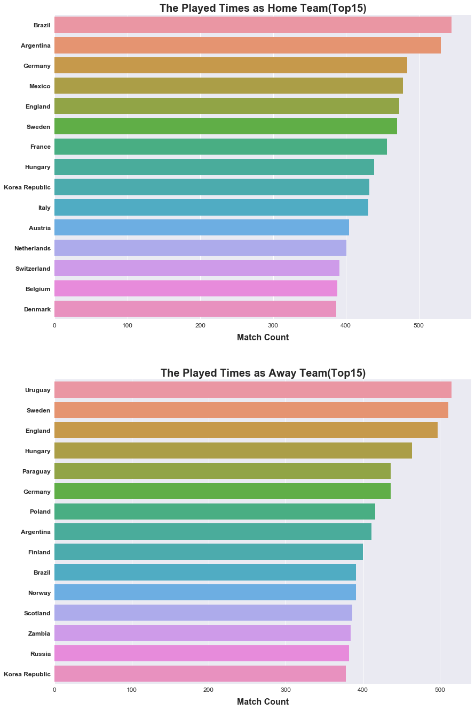
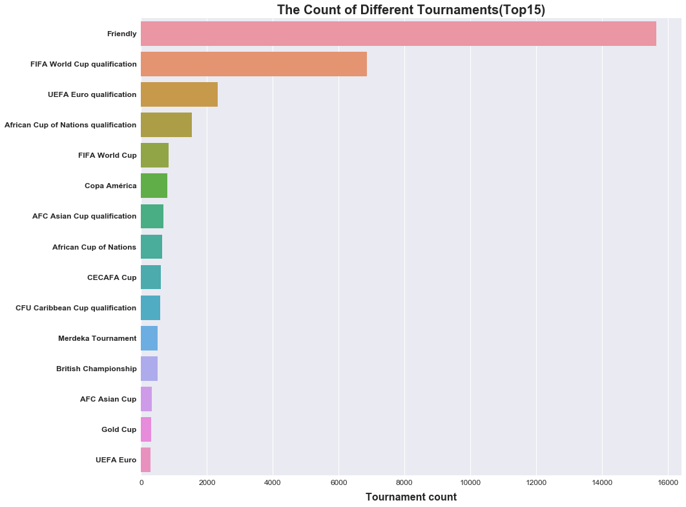
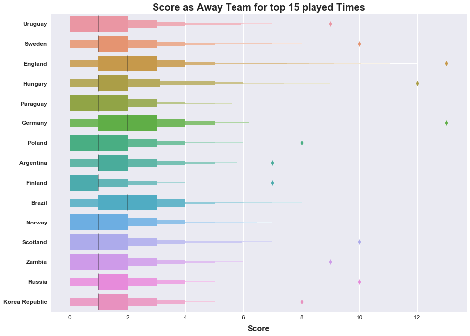
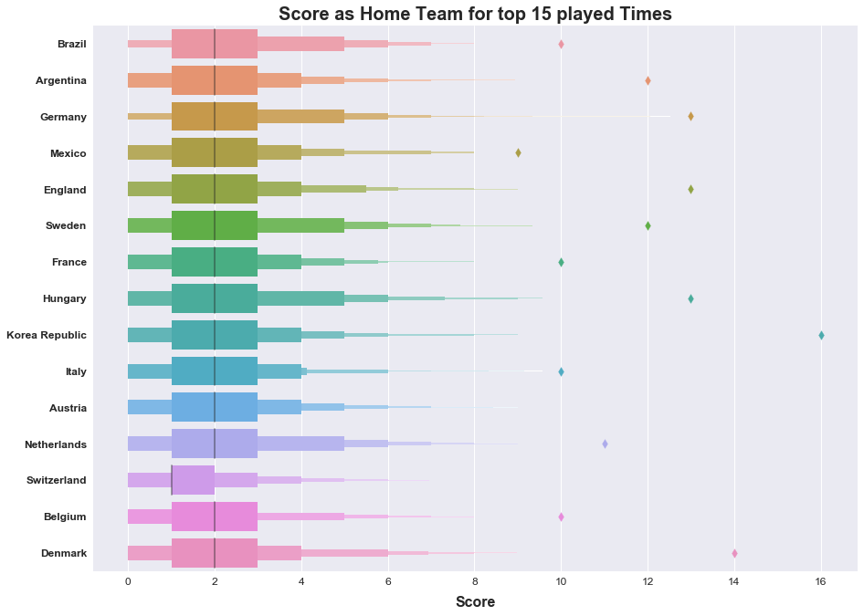
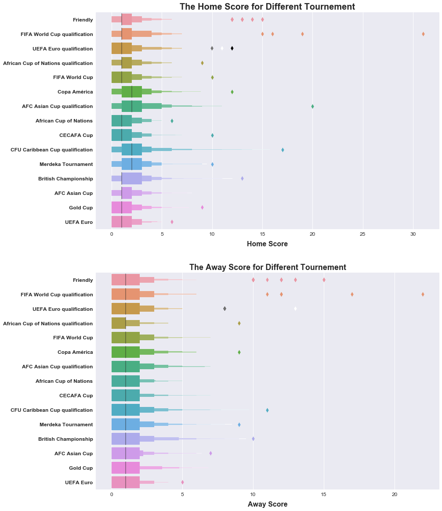
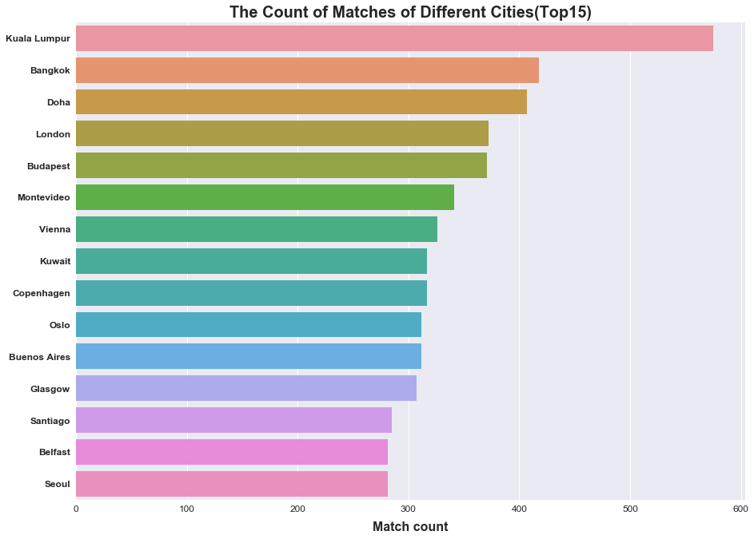
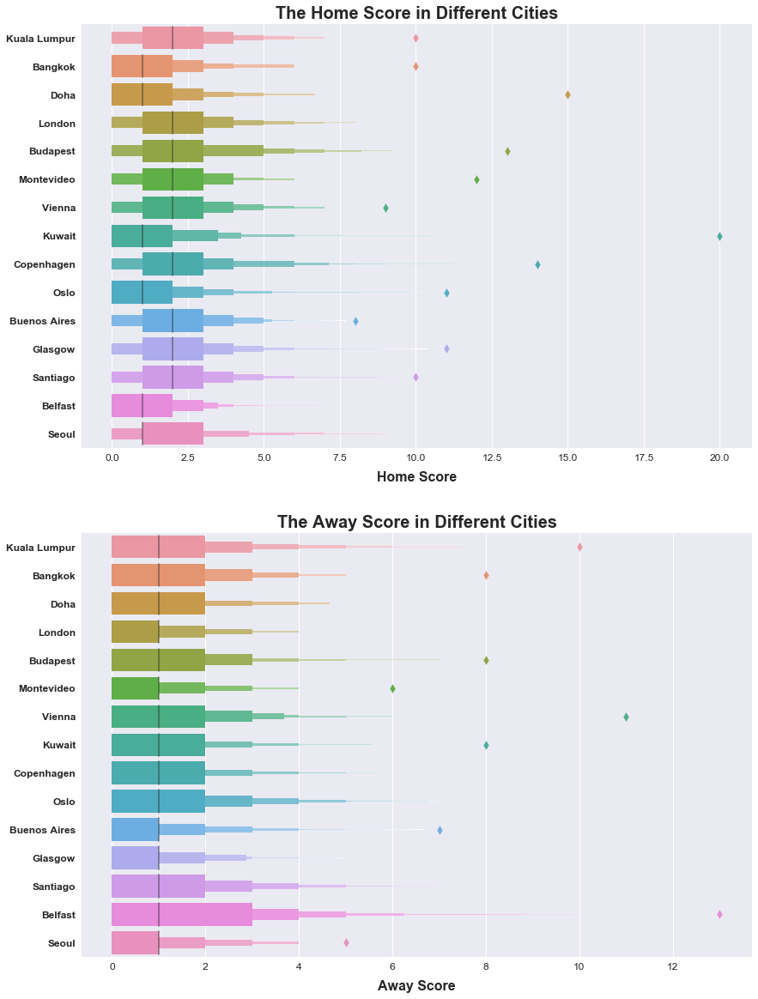

# soccer-data: 

## About this Dataset

International football results from 1872 to 2017
A dataset of nearly 40,000 international football results

### Context

Well, basically what happened was I was looking for a semi-definite easy to read list of international football matches and couldn't find anything decent. So I took it upon myself to collect it for my own use. I might as well share it.

### Content

This dataset includes 38,361 results of international football matches starting from the very first official match in 1972 up to 2017. The matches range from World Cup to Baltic Cup to regular friendly matches. The matches are strictly men's full internationals and the data does not include Olympic Games or matches where at least one of the teams was the nation's B-team, U-23 or a league select team.

results.csv includes the following columns:

date

home_team

away_team

home_ft

away_ft

tournament

city

country

### Acknowledgements

The data is gathered from several sources including but not limited to wikipedia, fifa.com, rsssf.com and individual football associations' websites.

## INPUTS AND OUTPUTS

```
#to enable visualizations 
%matplotlib inline
# Importing libraries
import numpy as np
import pandas as pd
import warnings
import matplotlib.pyplot as plt
import seaborn as sns
warnings.filterwarnings('ignore')

df.isnull().any().any()

# The Sorted Played Times Count of Different Team
home_team_Count = df.groupby(by=['home_team'])['tournament'].agg({'Count': np.size})
home_team_Count['Count'] = home_team_Count['Count'].astype(int)
home_team_Count = home_team_Count.sort_values(by = 'Count', ascending=False)
home_team_Count.head(10)

#Visualization for Count
TopHomeTeam = np.array(home_team_Count.head(15).index)
TopHomeTeamData = df[df['home_team'].isin(TopHomeTeam)]
TopAwayTeam = np.array(AwayTeamCount.head(15).index)
TopAwayTeamData = df[df['away_team'].isin(TopAwayTeam)]
f, axes = plt.subplots(2, 1, figsize=(14,23))
plt.sca(axes[0])
plt.title('The Played Times as Home Team(Top15)', fontsize = 20, weight = 'bold')
ax = sns.countplot(data=TopHomeTeamData, y='home_team', order=TopHomeTeam)
plt.setp(ax.get_xticklabels(), fontsize=12, weight = 'normal', rotation = 0);
plt.setp(ax.get_yticklabels(), fontsize=12, weight = 'bold', rotation = 0);
plt.xlabel('Match Count', fontsize=16, weight = 'bold', labelpad=10)
ax.yaxis.label.set_visible(False)

plt.sca(axes[1])
plt.title('The Played Times as Away Team(Top15)', fontsize = 20, weight = 'bold')
ax = sns.countplot(data=TopAwayTeamData, y='away_team', order=TopAwayTeam)
plt.setp(ax.get_xticklabels(), fontsize=12, weight = 'normal', rotation = 0);
plt.setp(ax.get_yticklabels(), fontsize=12, weight = 'bold', rotation = 0);
plt.xlabel('Match Count', fontsize=16, weight = 'bold', labelpad=10)
ax.yaxis.label.set_visible(False)
plt.show()

```


```
#Visualization for Count
fig = plt.figure(1, figsize=(12,10))
TopTournament = np.array(TournamentCount.head(15).index)
TopTournamentData = df[df['tournament'].isin(TopTournament)]
ax = sns.countplot(data= TopTournamentData, y ='tournament',order=TopTournament)
plt.title('The Count of Different Tournaments(Top15)', fontsize = 20, weight = 'bold')
plt.setp(ax.get_xticklabels(), fontsize=12, weight = 'normal', rotation = 0);
plt.setp(ax.get_yticklabels(), fontsize=12, weight = 'bold', rotation = 0);
plt.xlabel('Tournament count', fontsize=16, weight = 'bold', labelpad=10)
ax.yaxis.label.set_visible(False)
plt.show()
```


```
# Visualization for Scores
fig = plt.figure(1, figsize=(12,9))
plt.title('Score as Away Team for top 15 played Times', fontsize = 20, weight = 'bold')
ax = sns.lvplot(data=TopAwayTeamData, x='away_ft', y='away_team',order=TopAwayTeam)
plt.setp(ax.get_xticklabels(), fontsize=12, weight = 'normal', rotation = 0);
plt.setp(ax.get_yticklabels(), fontsize=12, weight = 'bold', rotation = 0);
plt.xlabel('Score', fontsize=16, weight = 'bold', labelpad=10)
ax.yaxis.label.set_visible(False)
plt.show()
```


```
# Visualization for Scores
fig = plt.figure(1, figsize=(12,9))
plt.title('Score as Home Team for top 15 played Times', fontsize = 20, weight = 'bold')
ax = sns.lvplot(data=TopHomeTeamData, x='home_ft', y='home_team',order=TopHomeTeam)
plt.setp(ax.get_xticklabels(), fontsize=12, weight = 'normal', rotation = 0);
plt.setp(ax.get_yticklabels(), fontsize=12, weight = 'bold', rotation = 0);
plt.xlabel('Score', fontsize=16, weight = 'bold', labelpad=10)
ax.yaxis.label.set_visible(False)
plt.show()
```


```
#Visualization for Counts
fig = plt.figure(1, figsize=(12,10))
TopTournament = np.array(TournamentCount.head(15).index)
TopTournamentData = df[df['tournament'].isin(TopTournament)]
ax = sns.countplot(data= TopTournamentData, y ='tournament',order=TopTournament)
plt.title('The Count of Different Tournaments(Top15)', fontsize = 20, weight = 'bold')
plt.setp(ax.get_xticklabels(), fontsize=12, weight = 'normal', rotation = 0);
plt.setp(ax.get_yticklabels(), fontsize=12, weight = 'bold', rotation = 0);
plt.xlabel('Tournament count', fontsize=16, weight = 'bold', labelpad=10)
ax.yaxis.label.set_visible(False)
plt.show()
```
   

```
#Visualization for Score in Different Tournaments
f, axes = plt.subplots(2, 1, figsize=(12,18))
plt.sca(axes[0])
TopTournament = np.array(TournamentCount.head(15).index)
TopTournamentData = df[df['tournament'].isin(TopTournament)]
plt.title('The Home Score for Different Tournement', fontsize = 20, weight = 'bold')
ax = sns.lvplot(data=TopTournamentData, x='home_ft', y='tournament',order=TopTournament)
plt.setp(ax.get_xticklabels(), fontsize=12, weight = 'normal', rotation = 0);
plt.setp(ax.get_yticklabels(), fontsize=12, weight = 'bold', rotation = 0);
plt.xlabel('Home Score', fontsize=16, weight = 'bold', labelpad=10)
ax.yaxis.label.set_visible(False)

plt.sca(axes[1])
plt.title('The Away Score for Different Tournement', fontsize = 18, weight = 'bold')
ax = sns.lvplot(data=TopTournamentData, x='away_ft', y='tournament',order=TopTournament)
plt.setp(ax.get_xticklabels(), fontsize=12, weight = 'normal', rotation = 0);
plt.setp(ax.get_yticklabels(), fontsize=12, weight = 'bold', rotation = 0);
plt.xlabel('Away Score', fontsize=16, weight = 'bold', labelpad=10)
ax.yaxis.label.set_visible(False)
plt.show()
```


```
# Visualization for Counts
fig = plt.figure(1, figsize=(12,9))
TopCity = np.array(CityCount.head(15).index)
TopCityData = df[df['city'].isin(TopCity)]
ax = sns.countplot(data= TopCityData, y ='city',order=TopCity)
plt.title('The Count of Matches of Different Cities(Top15)', fontsize = 20, weight = 'bold')
plt.setp(ax.get_xticklabels(), fontsize=12, weight = 'normal', rotation = 0);
plt.setp(ax.get_yticklabels(), fontsize=12, weight = 'bold', rotation = 0);
ax.yaxis.label.set_visible(False)
plt.xlabel('Match count', fontsize=16, weight = 'bold', labelpad=10)
plt.show()

```

```
# Visualization for scores
f, axes = plt.subplots(2, 1, figsize=(12,18))
plt.sca(axes[0])
plt.title('The Home Score in Different Cities', fontsize = 20, weight = 'bold')
ax = sns.lvplot(data=TopCityData, x='home_ft', y='city',order=TopCity)
plt.setp(ax.get_xticklabels(), fontsize=12, weight = 'normal', rotation = 0);
plt.setp(ax.get_yticklabels(), fontsize=12, weight = 'bold', rotation = 0);
plt.xlabel('Home Score', fontsize=16, weight = 'bold', labelpad=10)
ax.yaxis.label.set_visible(False)

plt.sca(axes[1])
plt.title('The Away Score in Different Cities', fontsize = 20, weight = 'bold')
ax = sns.lvplot(data=TopCityData, x='away_ft', y='city',order=TopCity)
plt.setp(ax.get_xticklabels(), fontsize=12, weight = 'normal', rotation = 0);
plt.setp(ax.get_yticklabels(), fontsize=12, weight = 'bold', rotation = 0);
plt.xlabel('Away Score', fontsize=16, weight = 'bold', labelpad=10)
ax.yaxis.label.set_visible(False)
plt.show()
```

```
```

```
